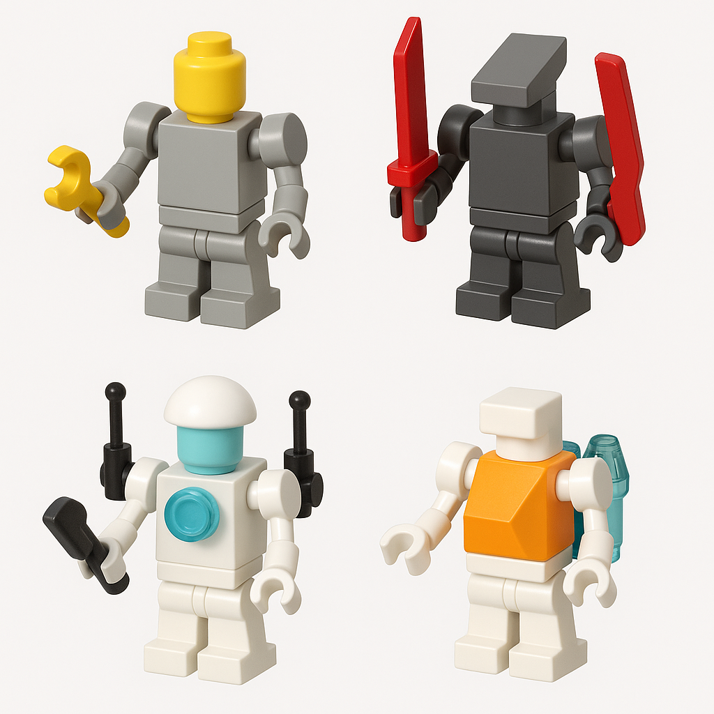
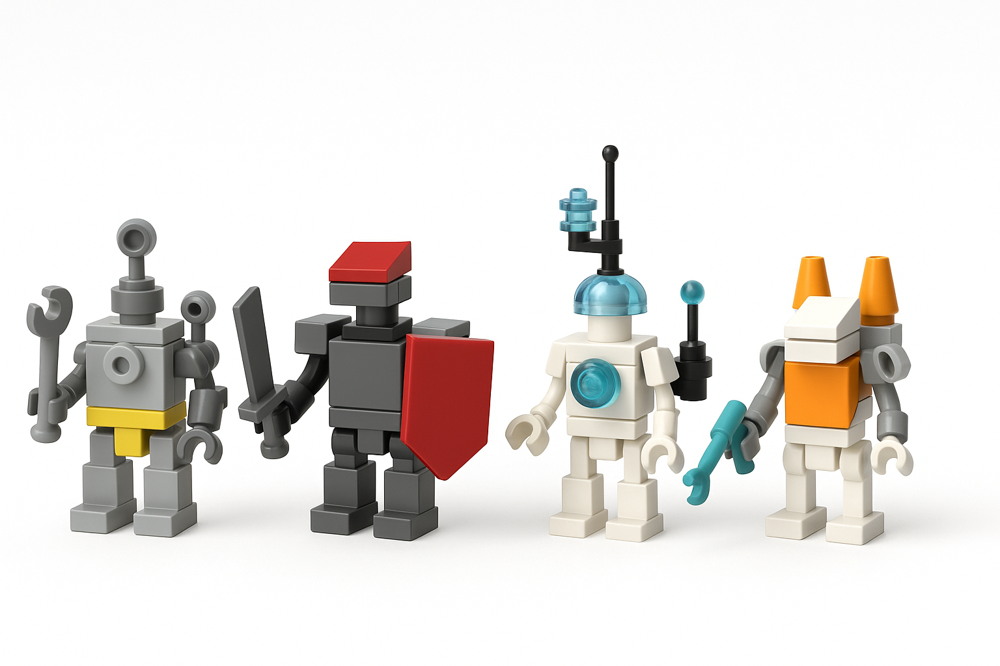
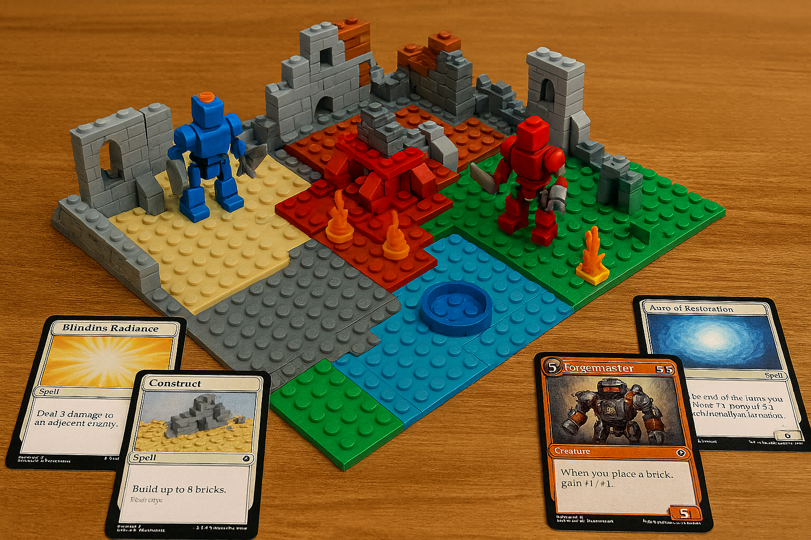

# 🧱 BrickQuest

A hybrid **tabletop + maker** game combining tactical card combat, LEGO building, and modular battlefield strategy.

[](https://opensource.org/licenses/MIT)
[](cards/sources/cards.csv)
[](cards/schema/card.schema.json)

## 🎮 What is BrickQuest?

BrickQuest is a tactical skirmish adventure that combines:
- 🃏 **Card game mechanics** for actions, events, and upgrades
- ⚔️ **Tactical combat** with strategic positioning and terrain
- 🧱 **LEGO building** for dynamic in-game construction

Players build and customize LEGO robot heroes, then battle across a modular battlefield using custom cards and strategic positioning.

## 🤖 Character Classes

Build, customize, and upgrade your LEGO robot heroes! Each class offers unique abilities and upgrade paths.

### Starter Characters


| Class | Description | Specialties |
|-------|-------------|-------------|
| 🔧 **Engineer** | Light bluish-gray with yellow accents | Construction, repair, defensive structures |
| ⚔️ **Warrior** | Dark bluish-gray with red armor | Combat, shields, offensive capabilities |
| 🔮 **MageCore** | White with translucent blue elements | Energy manipulation, sensors, magic |
| 🎭 **Trickster** | White with orange accents | Mobility, stealth, tactical positioning |

### Mid-Game Upgrades


Enhanced capabilities include advanced tool arms, dual weapons, sensor arrays, and stealth systems.

*Ready to build your own? Check out our [LEGO Parts Guide](#-lego-parts-setup) below!*

## 🎯 Gameplay in Action



**Experience the hybrid gameplay:**
- 🧱 **LEGO Board** - Dynamic 4-quadrant battlefield with terrain features
- 🃏 **Custom Cards** - Actions, structures, and abilities that interact with the board
- ⚔️ **Tactical Combat** - Position your figures strategically across different terrain
- 🔧 **Building Mechanics** - Use structure cards to modify the battlefield

*This image shows a mid-game scenario featuring LEGO robot characters, custom-built terrain, and various card types including action cards (movement, attacks), structure cards (defensive positions), and program cards (temporary abilities).*

## 🚀 Quick Start

### Prerequisites
- Node.js 16+ and npm
- Python 3.7+ (for card generation scripts)

### Installation & Setup
```bash
# Clone the repository
git clone https://github.com/samjhill/brickquest.git
cd brickquest

# Install dependencies
npm install

# Run the CLI prototype
npm run play

# Generate card templates
python scripts/generate_cards.py
```

### Card Development
```bash
# Card expansion system
npm run cards:build      # Convert CSV to JSON
npm run cards:lint       # Validate cards
npm run cards:balance    # Generate balance report
npm run cards:validate   # Run all validation
```

## 🃏 Card System

BrickQuest features **5 card types** with a complete content pipeline and **35 total cards**.

### Card Types Overview
| Type | Count | Description |
|------|-------|-------------|
| **Action** | 15 | Movement, attack, defend, repair |
| **Structure** | 6 | Create physical objects with LEGO building |
| **Program** | 6 | Give temporary AI to your robot |
| **Reaction** | 3 | Speed-play during other players' phases |
| **Loot & Upgrade** | 5 | Permanent improvements |

### Faction Themes
- **Steampunk** - Gears, pressure, steam vents, mechanical complexity
- **Cyber** - Sensors, overclock, EMP, digital warfare  
- **Arcane** - Crystals, runes, storms, magical energy
- **Neutral** - Universal, adaptable, foundational

## 🛠️ Content Pipeline

Our robust content pipeline ensures high-quality, balanced cards:

- **CSV to JSON ETL** - Convert human-editable CSV to validated JSON
- **Card Linter** - Schema validation and design rule enforcement
- **Balance Report** - Energy curve analysis and balance recommendations
- **Duplicate Detection** - Find near-duplicate card designs
- **Printable Cards** - Generate print-ready card layouts

## 🖨️ Card Printing

### Printable Cards HTML
- **File**: `brickquest_printable_cards.html`
- **Layout**: A4 format, 3 cards per row, 9 cards per page
- **Quality**: Designed for 300gsm cardstock printing
- **Features**: Filter by card type, print statistics, professional layout

### Print Instructions
1. Open `brickquest_printable_cards.html` in your browser
2. Select desired card type from dropdown
3. Print on high-quality paper (300gsm cardstock recommended)
4. Cut along card borders
5. Consider laminating for durability

## 🧱 LEGO Parts Setup

### Getting Started
BrickQuest characters are built with LEGO bricks! Get started with our curated parts list:

- **Parts Specification**: [BrickLink Parts Spec](docs/bricklink_parts_spec.md)
- **BrickLink Wanted List**: Import `brickquest_starter_bricklink_wantedlist.xml` to [bricklink.com](https://bricklink.com)
- **Regenerate XML**: Run `python3 scripts/generate_bricklink_xml.py`

The starter set includes parts for 4 character classes plus upgrade mods and spare parts for customization.

## 📁 Project Structure

```
brickquest/
├── src/
│   ├── engine/          # Core game engine
│   ├── client/          # React frontend
│   └── server/          # Node.js backend
├── cards/
│   ├── schema/          # JSON schema definitions
│   ├── expansions/      # Card sets and decklists
│   ├── sources/         # Human-editable CSV files
│   └── factions/        # Faction-specific cards
├── docs/                # Game rules and guides
├── assets/              # Images and media
├── scripts/             # Helper utilities
└── tools/               # Development tools
```

## 📚 Documentation

### Core Documentation
- [Game Rules](docs/GAME_RULES.md) - Complete game mechanics and rules
- [Card Reference](docs/CARD_REFERENCE.md) - Card types and effects

### Design & Development
- [Card Design Guide](docs/CARD_DESIGN_GUIDE.md) - Comprehensive design principles
- [Card Printing Guide](docs/CARD_PRINTING_GUIDE.md) - Printing instructions
- [Icon Map](docs/ICON_MAP.md) - Complete icon-to-emoji mapping

### Analysis & Reports
- [Playtest Results](PLAYTEST_RESULTS.md) - Simulation analysis and recommendations

### Generated Reports
- [Balance Report](docs/generated/BALANCE.md) - Energy curve analysis
- [Duplicate Report](docs/generated/DUPLICATES.md) - Duplicate card detection

## 🤝 Contributing

This is an open-source project! We welcome contributions in many areas:

### Ways to Contribute
- **🎴 Add new cards** - Use the CSV format in `cards/sources/` for easy editing
- **📦 Create expansions** - Follow the card design guide for balanced content
- **⚙️ Improve the game engine** - Enhance core mechanics and systems
- **📖 Create campaign content** - Write quests, encounters, and storylines
- **🎨 Add new factions** - Create themed card sets with unique mechanics
- **🛠️ Improve tooling** - Enhance the content pipeline and validation tools

### Card Creation Workflow
1. Edit `cards/sources/cards.csv` with new card data
2. Run `npm run cards:build` to generate JSON
3. Run `npm run cards:validate` to check for issues
4. View `brickquest_printable_cards.html` to see the results
5. Submit a pull request with your additions!

### Development Setup
```bash
# Install dependencies
npm install

# Run development server
npm run dev

# Run tests
npm test

# Build for production
npm run build
```

## 📄 License

MIT License - see [LICENSE](LICENSE) file for details.

---

**Ready to start your BrickQuest adventure?** Check out the [Game Rules](docs/GAME_RULES.md) and [Quick Start](#-quick-start) sections above!